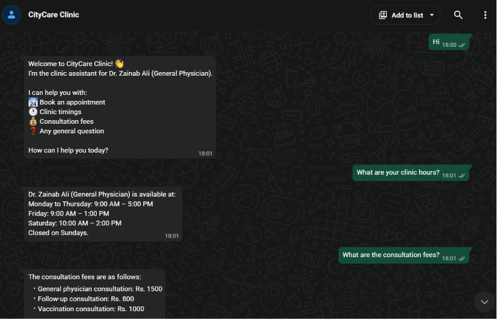
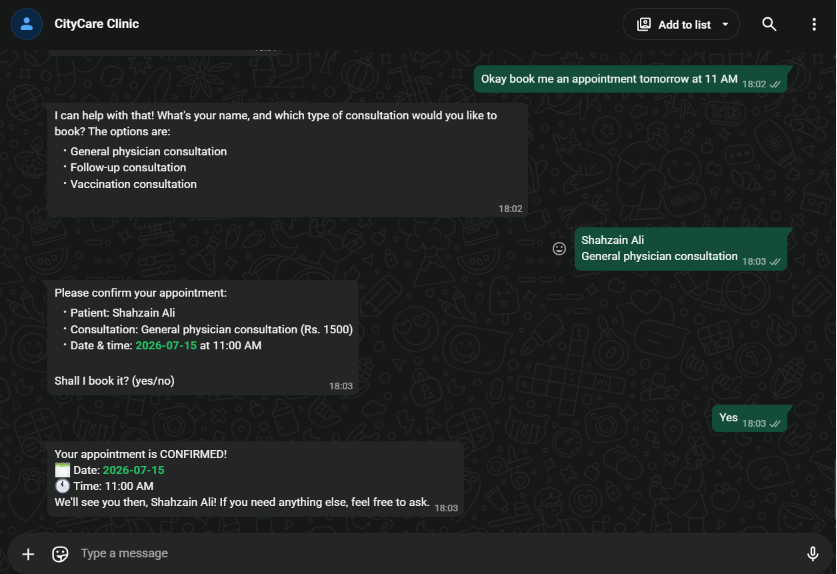
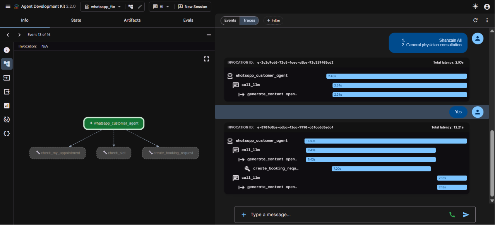
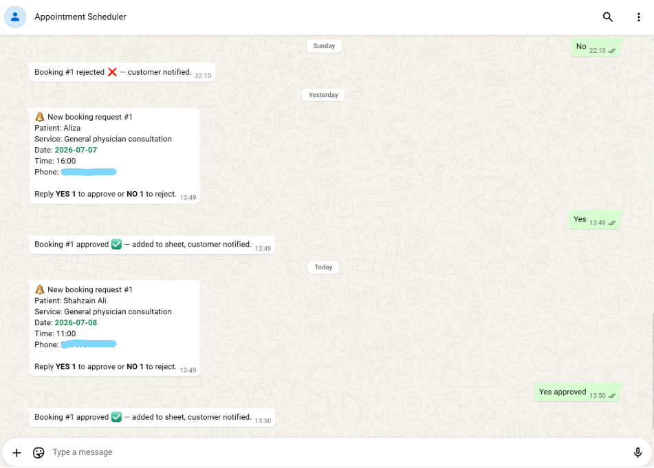
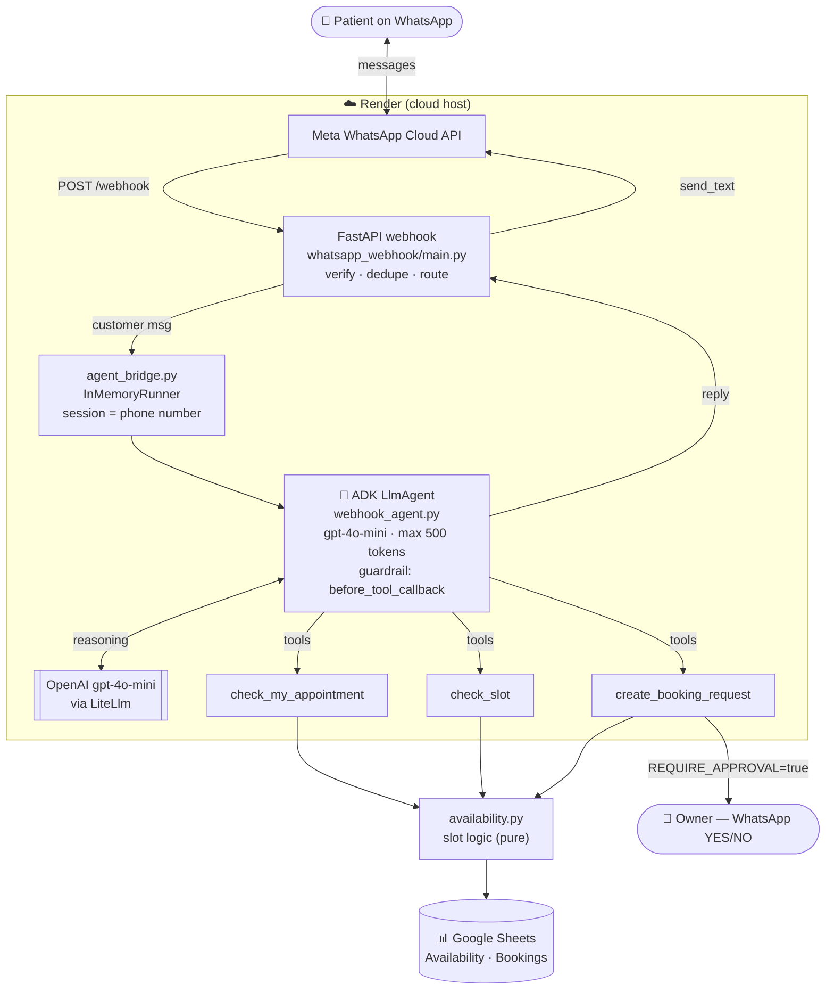
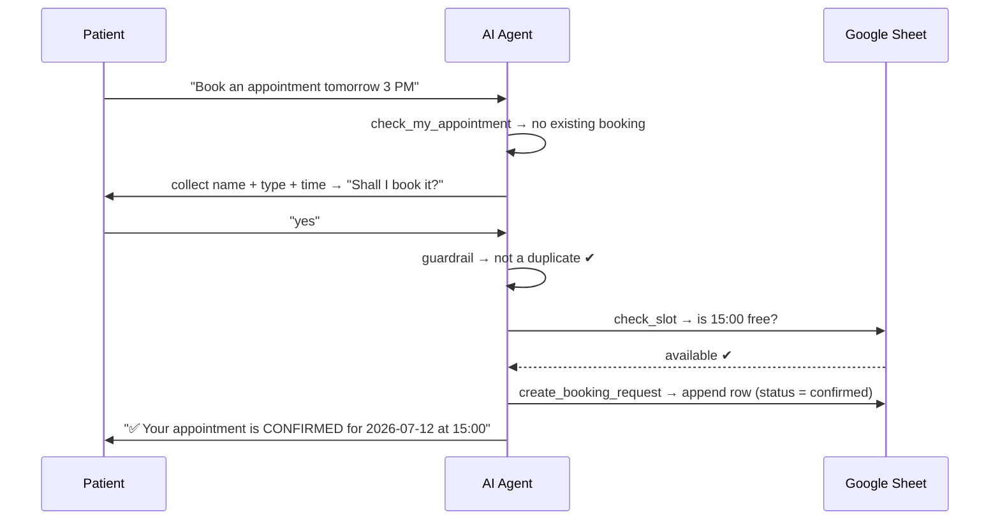

# 🩺 WhatsApp Digital FTE — AI Receptionist for Clinics

> An AI employee that runs a clinic's WhatsApp front desk **24/7** — answers patient
> questions and books appointments **end-to-end**, backed by a live Google Sheet.

<p align="left">
  
  
  
  
  
  
</p>

---

## 📖 Overview

Most clinics lose bookings after hours — patients message at midnight, nobody replies,
they go elsewhere. **WhatsApp Digital FTE** is an AI receptionist that never sleeps: it
greets patients, answers questions strictly from the clinic's knowledge base (fees,
timings, services), and **books appointments directly** against a real-time Google Sheet.

It is built on the **Google Agent Development Kit (ADK)**, exposed to real customers
through a **FastAPI webhook** on the **WhatsApp Cloud API**, and deployed live on
**Render**.

> **Demo clinic:** *CityCare Clinic* — Dr. Zainab Ali (General Physician), Karachi.
> Swap `whatsapp_fte/business_profile.json` to run it for any business.

---

## 📸 Demo

### 1. Answering patient questions — grounded & selective


> Greets the patient and answers **only from the clinic's knowledge base** — ask for hours,
> get just the hours; ask for fees, get just the fees. It never invents information.

### 2. Booking an appointment — end-to-end (default: auto-confirm)


> *"book me an appointment tomorrow at 11 AM"* → collects the details → shows a summary to
> confirm → **books it and confirms instantly.** Zero human touch, 24/7.

### 3. Under the hood — Google ADK trace (`adk web`)


> One turn's **trace / span** view: the LLM calls (`generate_content`) and the
> `create_booking_request` tool execution, each with its own latency — full observability.

### 4. Optional human-in-the-loop (`REQUIRE_APPROVAL=true`)


> Flip the flag and every booking is routed to the clinic first — the owner replies
> **YES / NO** on WhatsApp before the appointment is confirmed.

---

## ✨ Key Features

| Feature | What it does |
|---|---|
| 🤖 **Autonomous booking** | Answers → collects details → checks the slot → **confirms end-to-end**, zero human touch |
| 📅 **Real-time availability** | Slots are computed live from a Google Sheet (`Availability` − `Bookings`) on every request — never stale |
| 🛡️ **Double-booking guardrail** | An ADK `before_tool_callback` blocks a customer who already has an active booking from booking again; separately, the slot check stops two different patients taking the same time |
| 🔀 **Optional human approval (HITL)** | Flip `REQUIRE_APPROVAL=true` to route every booking to the clinic owner for a WhatsApp YES/NO — off by default |
| 💰 **Cost control** | Per-reply output cap (`max_output_tokens=500`) keeps every message cheap and bounded |
| 🧠 **Grounded answers** | Replies only from the preloaded business profile — never invents prices, hours, or services |
| 🔐 **Secrets-safe** | All keys live in a git-ignored `.env`; a service account authorizes Google Sheets |
| 🖥️ **Local debugging** | `adk web` gives a full trace/span view of every turn (LLM calls, tool calls, latency) |

---

## 🏗️ Architecture



**Two independent safety layers (both modes):**
- **Guardrail** (`_block_duplicate_booking`) → *one customer, one active booking*. Once a
  patient already has an upcoming or pending appointment, any attempt to book **another**
  is blocked before the tool runs — the agent tells them their existing booking stands
  (phone-based).
- **Slot check** (`is_available`) → *one slot, one patient*. A time already taken by
  **anyone** cannot be booked again (date + time based).

---

## 🔁 How a booking works (default: auto-confirm)



Appointment slots are **generated**, not stored: for each day the code walks from
`Open` to `Close` in steps of `SlotMinutes` (e.g. `09:00, 09:30, 10:00 …`), then
subtracts times already taken in the `Bookings` tab. A patient can only pick a valid
slot start — so overlaps are impossible by construction.

---

## 🧰 Tech Stack

| Layer | Technology |
|---|---|
| **Agent framework** | Google ADK (`LlmAgent`, tools, `before_tool_callback`, `adk web`) |
| **LLM** | OpenAI `gpt-4o-mini` via `LiteLlm` |
| **Messaging** | WhatsApp Cloud API (Meta Graph API) |
| **Web server** | FastAPI + Uvicorn |
| **Data backend** | Google Sheets (`gspread` + `google-auth` service account) |
| **Deployment** | Render (Docker) |
| **Config** | `python-dotenv` |

---

## 📂 Project Structure

```
whatsapp-digital-fte/
├── whatsapp_fte/                 # The agent + its business logic (the "brain")
│   ├── webhook_agent.py          # Builds the LlmAgent: model, prompt, tools, guardrail
│   ├── prompt_loader.py          # Generic loader: load_instruction_from_file(...)
│   ├── prompts/
│   │   └── customer_agent.txt    # System prompt (templated: KB + date placeholders)
│   ├── knowledge_base.py         # Preloads business_profile.json into the prompt
│   ├── business_profile.json     # The clinic's data (name, doctor, fees, hours, FAQs)
│   ├── availability.py           # Pure slot logic (generate slots, free/taken, is_available)
│   ├── booking_store.py          # In-memory pending store (HITL mode only)
│   ├── sheets_client.py          # Google Sheets read/write (Availability + Bookings)
│   ├── whatsapp_client.py        # Sends messages via the WhatsApp Cloud API
│   └── agent.py                  # Exposes root_agent for `adk web`
├── whatsapp_webhook/             # The live product entry point
│   ├── main.py                   # FastAPI GET/POST /webhook (verify + inbound routing)
│   └── agent_bridge.py           # ADK Runner + per-customer session (session = phone)
├── Dockerfile                    # Container for deployment
├── requirements.txt
└── .env.example                  # Copy → whatsapp_fte/.env and fill in your values
```

---

## 🚀 Getting Started

### Prerequisites
- **Python 3.12+**
- A **Meta / WhatsApp Cloud API** app (test number is fine) — [developers.facebook.com](https://developers.facebook.com/)
- An **OpenAI API key**
- A **Google Cloud service account** with access to your Google Sheet
- **ngrok** (or any HTTPS tunnel) for local webhook testing

### 1. Clone & install
```bash
git clone https://github.com/Shahzain-Ali/whatsapp-digital-fte.git
cd whatsapp-digital-fte
python -m venv .venv && source .venv/bin/activate
pip install -r requirements.txt
```

### 2. Configure secrets
```bash
cp .env.example whatsapp_fte/.env
# then open whatsapp_fte/.env and fill in your own values
```
Place your Google service-account key at `.secrets/gsa-key.json` (git-ignored).

### 3. Prepare the Google Sheet
Create a spreadsheet with two tabs and share it with the service-account email:

- **`Availability`** — columns: `Day, Open, Close, SlotMinutes`
  (e.g. `Monday, 09:00, 17:00, 30`)
- **`Bookings`** — columns: `Date, Time, PatientName, Service, Phone, Status, CreatedAt`

### 4. Run locally
```bash
# Terminal 1 — the webhook
uvicorn whatsapp_webhook.main:app --port 8000

# Terminal 2 — expose it to Meta
ngrok http 8000
```
Set the ngrok HTTPS URL + your `WHATSAPP_VERIFY_TOKEN` in the Meta webhook config,
then message your WhatsApp test number.

### 5. (Optional) Debug the agent visually
```bash
adk web --host 0.0.0.0 --port 8000
```
Opens a UI to inspect every turn's **traces & spans** — LLM calls, tool calls, and latency.

---

## ⚙️ Configuration

All values live in a **git-ignored** `whatsapp_fte/.env` (names only shown here):

| Variable | Purpose |
|---|---|
| `OPENAI_API_KEY` | Model access (OpenAI via LiteLlm) |
| `WHATSAPP_ACCESS_TOKEN` | WhatsApp Cloud API auth |
| `WHATSAPP_PHONE_NUMBER_ID` | The sending WhatsApp number's ID |
| `WHATSAPP_BUSINESS_ACCOUNT_ID` | Meta WhatsApp Business account ID |
| `WHATSAPP_VERIFY_TOKEN` | Secret echoed back during Meta's webhook handshake |
| `WHATSAPP_OWNER_NUMBER` | Owner number for HITL approval routing (HITL mode) |
| `REQUIRE_APPROVAL` | `false` (default) = auto-confirm; `true` = owner-approval (HITL) |
| `DEMO_CUSTOMER_PHONE` | A phone with a booking, used only to demo the guardrail in `adk web` |
| `FORCE_IPV6` | Set to `1` only if your IPv4 route to Meta is broken (network workaround) |

### 🔀 The `REQUIRE_APPROVAL` toggle
- **`false` (default)** — the AI books **end-to-end**: validates the slot and writes the
  confirmed booking straight to the sheet. True 24/7 automation.
- **`true`** — every booking is held **pending** and sent to `WHATSAPP_OWNER_NUMBER`;
  the owner replies `YES <id>` / `NO <id>` to confirm or reject.

The real-time slot check and the duplicate guardrail run in **both** modes, so booking
safety is identical either way.

---

## 🧪 Concepts Demonstrated

- **Agentic design** — a single ADK agent with tools, a system prompt, and stateful,
  per-customer sessions.
- **Tool use & function calling** — the model decides when to check a slot vs. book.
- **Safety / guardrails** — a `before_tool_callback` interceptor + secrets management.
- **Human-in-the-loop (optional)** — a cross-channel approval workflow behind a flag.
- **Deployability** — containerized and running live on the public internet.
- **Observability** — full trace/span inspection via `adk web`.

---

## 🗺️ Roadmap

- 🎙️ **v2 — Voice/calls** on WhatsApp (Twilio ConversationRelay + speech-to-text/TTS)
- 🗄️ **Persistent sessions** (`DatabaseSessionService`) to survive restarts
- 🏥 **Multi-doctor / multi-tenant** scheduling
- 📊 An **owner dashboard** beyond the raw sheet

---

## 👤 Author

**Shahzain Ali** — AI Automation Developer (Karachi, Pakistan)
Building custom AI agents from scratch (Google ADK / OpenAI Agents SDK + MCP servers).

- 🔗 LinkedIn: [linkedin.com/in/shahzain-ali1](https://linkedin.com/in/shahzain-ali1)
- ▶️ YouTube: [@SolutionsWithShahzain](https://youtube.com/@SolutionsWithShahzain)

---

<sub>Built as a hands-on demonstration of production-grade agentic engineering with Google ADK.</sub>
